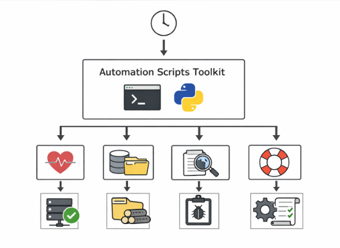
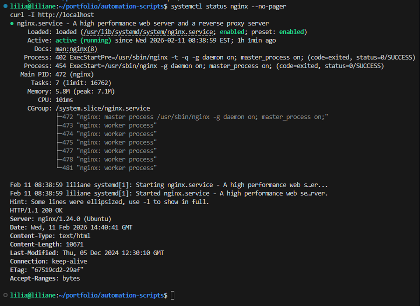
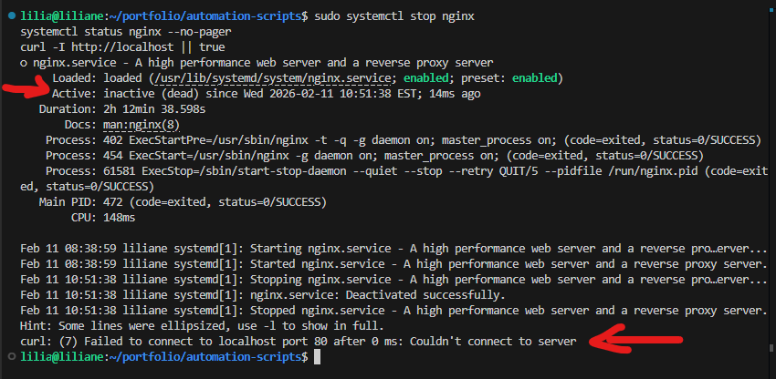
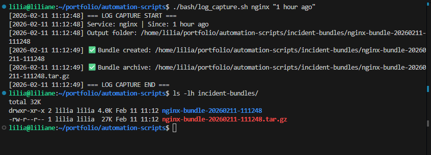
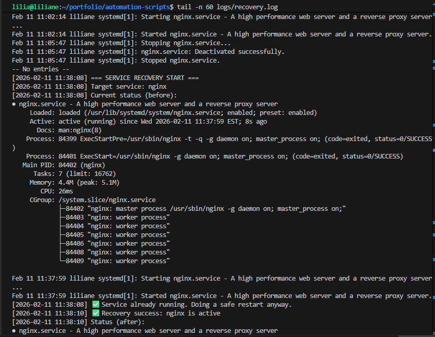
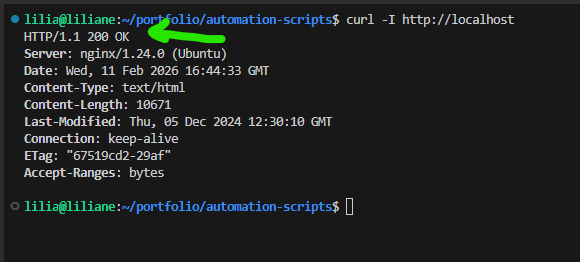
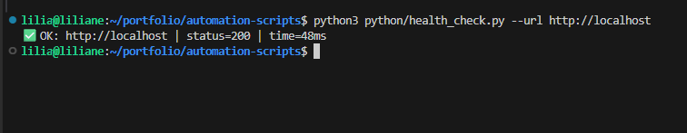
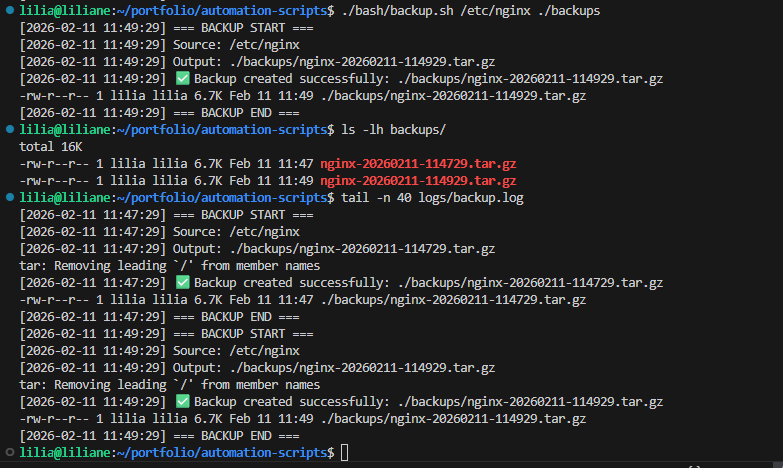
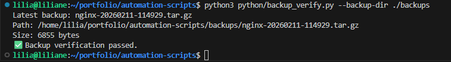

# Automation Scripts (Python + Bash) — Health Checks, Backups, Log Capture, Service Recovery 

This project is my **ops automation toolkit** using **Bash + Python** on Linux.

I’m simulating a very real scenario I’ve seen in production:
- a web service goes down
- I need proof fast (status, logs)
- I recover the service
- I run a backup + verify it
- I package everything so it’s easy to share as an “incident bundle”

---

## Problem

In real operations, outages don’t wait for a meeting.

A service can crash, CPU/memory can spike, and when you finally SSH in, you waste time doing the same manual steps:
- check service status
- check ports
- curl the endpoint
- grab logs
- restart service
- prove the fix
- capture evidence for postmortem

That manual work is slow and inconsistent, and it’s easy to miss something during stress.

---

## Solution

I automated the “first 15 minutes of incident response” with scripts that:

- **Health Check (Bash):** verifies service state + port + curl endpoint
- **Health Check (Python):** verifies HTTP endpoint + response time
- **Backup (Bash):** creates a timestamped backup archive and logs the run
- **Backup Verify (Python):** confirms the newest backup exists and is not empty
- **Log Capture (Bash):** collects system + service logs into a timestamped incident bundle
- **Service Recovery (Bash):** restarts the service and logs proof of success

Everything writes to logs so I have evidence even after the terminal scrolls away.

---

## Architecture Diagram

Screenshot: screenshots/architecture.png



A scheduled timer triggers a Linux automation toolkit that runs four main actions—health checks, backups, log capture, and recovery—to keep services stable and produce proof logs.

---

## Step-by-step CLI 

### Scenario I’m simulating

I’m using **nginx** as a simple “production-like” service because it’s available on most Linux boxes.

**Incident:** “User reports the website is down.”  
**My goal:** prove it, capture evidence, recover service, verify service is back.

> Have nginx installed:

```bash
sudo apt update
sudo apt install -y nginx
````

---

### 1) Create the project folder structure

```bash
mkdir -p automation-scripts/{bash,python,logs,backups,incident-bundles,screenshots}
cd automation-scripts
```

---

### 2) Make scripts executable (after adding code)

```bash
chmod +x bash/*.sh python/*.py
```

---

### 3) Baseline check: service is healthy (before incident)

```bash
systemctl status nginx --no-pager
curl -I http://localhost
```

✅ Expected:

* nginx is `active (running)`
* curl returns `HTTP/1.1 200 OK`

**Screenshot:** `screenshots/00-baseline-healthy.png`



---

### 4) Simulate the outage (service down)

```bash
sudo systemctl disable --now nginx
sudo systemctl mask nginx
sudo systemctl stop nginx
systemctl status nginx --no-pager
curl -I http://localhost || true
```

✅ Expected:

* nginx becomes `inactive (dead)` (or failed)
* curl fails (connection refused / could not connect)

**Screenshot:** `screenshots/01-service-down.png`


---

### 5) Run the Health Check (Bash) to confirm the failure

```bash
./bash/health_check.sh nginx 80 http://localhost
```

✅ Expected output (example):

* ❌ service is NOT active
* ❌ port is NOT listening (80)
* ❌ curl check failed

Also confirm the log proof:

```bash
tail -n 40 logs/health-check.log
```

**Screenshot:** `screenshots/02-health-check-fail.png`


---

### 6) Capture logs immediately (before touching anything)

This is what I do in real ops — capture evidence first.

```bash
./bash/log_capture.sh nginx "1 hour ago"
ls -lh incident-bundles/
```

✅ Expected:

* a folder like: `incident-bundles/nginx-bundle-YYYYMMDD-HHMMSS`
* an archive like: `incident-bundles/nginx-bundle-YYYYMMDD-HHMMSS.tar.gz`

**Screenshot:** `screenshots/03-incident-bundle-created.png`



---

### 7) Recover the service (restart + proof)

```bash
sudo systemctl unmask nginx
sudo systemctl enable --now nginx

./bash/service_recovery.sh nginx
systemctl status nginx --no-pager
```

✅ Expected:

* nginx becomes `active (running)` again

Proof log:

```bash
tail -n 60 logs/recovery.log
```

**Screenshot:** `screenshots/04-recovery-success.png`


---

### 8) Validate the fix (endpoint up again)

```bash
curl -I http://localhost
```

✅ Expected:

* `HTTP/1.1 200 OK`

**Screenshot:** `screenshots/05-endpoint-healthy.png`



---

### 9) Run the Python health check (response time proof)

```bash
python3 python/health_check.py --url http://localhost
```

✅ Expected:

* `✅ OK` + status code + time in ms

**Screenshot:** `screenshots/06-python-health-check.png`



---

### 10) Run a backup (simulate config backup after incident)

After recovery, I like to back up configs/log proof (example: backup `/etc/nginx`).

```bash
./bash/backup.sh /etc/nginx ./backups
ls -lh backups/
tail -n 40 logs/backup.log
```

✅ Expected:

* `backups/nginx-YYYYMMDD-HHMMSS.tar.gz` exists
* backup log shows success

**Screenshot:** `screenshots/07-backup-success.png`



---

### 11) Verify backup integrity (Python)

```bash
python3 python/backup_verify.py --backup-dir ./backups
```

✅ Expected:

* shows latest backup file + size > 0
* `✅ Backup verification passed`

**Screenshot:** `screenshots/08-backup-verify.png`



---


---

## Outcome

After running this project:

* I can **confirm outages fast** (service + port + endpoint)
* I can **capture evidence first** (incident bundle with logs)
* I can **recover services quickly** with repeatable steps
* I can **prove recovery worked** (systemctl + curl + python check)
* I can **run backups + verify** they are valid

This is the same type of automation I’d keep on a server to reduce downtime and make incident response consistent.

---

## Troubleshooting

### `Permission denied` when running scripts

```bash
chmod +x bash/*.sh python/*.py
```

### nginx not installed

```bash
sudo apt update
sudo apt install -y nginx
```

### Health check fails because service name is wrong

List services:

```bash
systemctl list-units --type=service | grep -i nginx
```

### Port check fails but service says running

Check listening ports:

```bash
sudo ss -tulnp | grep -E '(:80\b|:443\b)'
```

### curl fails even though service is active

Check nginx config:

```bash
sudo nginx -t
sudo systemctl restart nginx
```

### log_capture bundle has missing logs

Some distros don’t use `/var/log/syslog`. Try:

```bash
sudo journalctl -xe
sudo tail -n 200 /var/log/messages || true
```

### service keeps crashing after restart

That means the restart is not the real fix. Check root cause:

```bash
sudo journalctl -u nginx --since "30 min ago" --no-pager | tail -n 120
df -h
free -m
sudo nginx -t
```

---

## Notes (Ops mindset)

* I always **capture logs first** before making changes.
* I always **prove the fix** with both service status and endpoint checks.
* I always keep logs in a folder so I can share proof in a postmortem.

```

---

## Real ops rule of thumb

* Restart = restore service

* Root-cause fix = make it not happen again

“Restart recovered the service quickly, then I investigated logs and system conditions to find and fix the root cause.”


### 1) Disk full

**Investigate**

```bash
df -h
df -i
sudo du -xh /var | sort -h | tail -n 30
sudo journalctl -u nginx --since "1 hour ago" --no-pager | tail -n 200
```

**Fix**

```bash
# free space (common safe targets)
sudo journalctl --vacuum-time=7d
sudo apt-get clean
sudo rm -rf /var/log/*.gz /var/log/*.[0-9] /var/log/*-???????? 2>/dev/null || true
sudo rm -rf /var/cache/apt/archives/*.deb 2>/dev/null || true

# restart after cleanup
sudo systemctl restart nginx
```

---


### 2) Bad config (nginx example)

**Investigate**

```bash
sudo nginx -t
sudo journalctl -u nginx --since "30 min ago" --no-pager | tail -n 200
sudo tail -n 200 /var/log/nginx/error.log 2>/dev/null || true
```

**Fix**

```bash
# revert last change (example: default site)
sudo cp /etc/nginx/sites-available/default.bak /etc/nginx/sites-available/default 2>/dev/null || true

# or edit and correct config
sudo nano /etc/nginx/nginx.conf
sudo nano /etc/nginx/sites-available/default

# validate + reload/restart
sudo nginx -t
sudo systemctl reload nginx || sudo systemctl restart nginx
```

---

### 3) Port conflict (something else using port 80/443)

**Investigate**

```bash
sudo ss -ltnp | grep -E '(:80|:443)\b' || true
sudo lsof -i :80
sudo lsof -i :443
sudo journalctl -u nginx --since "30 min ago" --no-pager | tail -n 200
```

**Fix**

```bash
# stop the conflicting service (common examples)
sudo systemctl stop apache2 2>/dev/null || true
sudo systemctl stop httpd 2>/dev/null || true

# or change nginx to a free port then reload (example edit)
sudo nano /etc/nginx/sites-available/default
sudo nginx -t
sudo systemctl restart nginx
```

---

### 4) OOM (out of memory kill)

**Investigate**

```bash
free -m
top
dmesg -T | egrep -i 'oom|killed process' | tail -n 50
sudo journalctl --since "1 hour ago" --no-pager | egrep -i 'oom|killed process|out of memory' | tail -n 100
systemctl show nginx -p NRestarts
```

**Fix**

```bash
# immediate mitigation: restart service
sudo systemctl restart nginx

# reduce memory pressure (stop heavy processes you don’t need)
ps aux --sort=-%mem | head -n 15
sudo kill <PID>

# add swap (quick stabilization)
sudo fallocate -l 2G /swapfile
sudo chmod 600 /swapfile
sudo mkswap /swapfile
sudo swapon /swapfile
swapon --show
```


